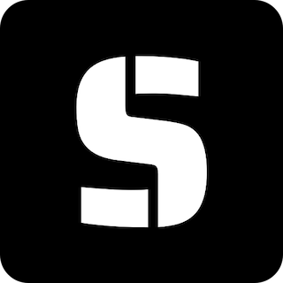

# Substratus

Deploy and fine-tune large language models on K8s

Substratus is a cross-cloud substrate for training and serving ML models. It
extends the Kubernetes control plane to orchestrate ML operations through the
addition of custom resource definitions: Model, Server, Dataset, and Notebook.

---

Features:

* Deploy state-of-the-art ML models in minutes. We ❤️ open source LLMs.
* Fine-tune without writing code.
* Built-in serving layer compatible with OpenAI APIs.
* Run Notebooks to experiment. Ship an identical serving environment to production.

Our one-minute demo shows the basics:

Learn more at [substratus.ai](https://www.substratus.ai).

## Documentation

What problems can Substratus solve? Our
[introduction docs](https://www.substratus.ai/docs) break it down.

Want to get started fast? Our
[quickstart](https://www.substratus.ai/docs/quickstart) will have you stand up a
model in minutes.

## Collaborators are welcome

See the [development docs](../docs/development.md) to get started. Our
[docs directory](../docs/) has all the details.

## Architecture

Want to learn more about how Substratus works? Our
[architecture](https://www.substratus.ai/docs/architecture) documentation is a
great place to dive in. We've got diagrams to spare!

---

Disclaimer: Substratus is under rapid development. We also value stability.
Hang tight!
