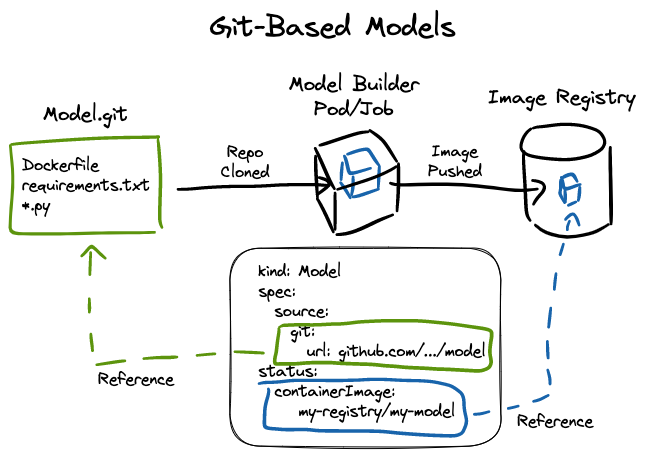
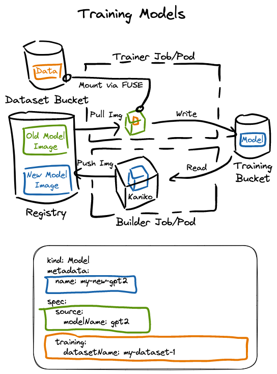
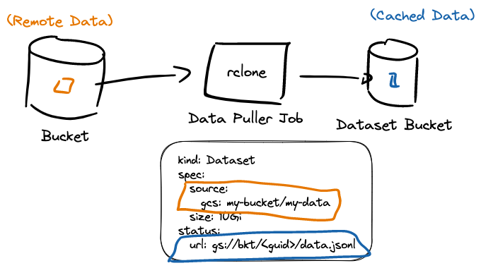
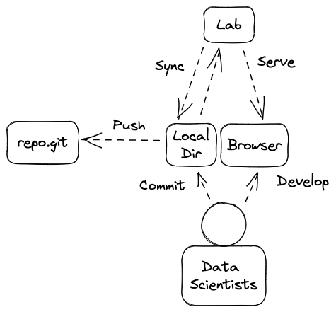

# Architecture

## Models

### Base Models

Base models are built from a Git repository by specifying `.spec.source.git` in a `kind: Model` object.

</img>

### Training New Models

Training is triggered by creating a `kind: Model` with `.spec.training` and `.spec.source.modelName` set. It can be thought of as combining an existing model with a new set of data, producing a new model.

</img>

## Datasets

The Dataset API is used to describe data that can be referenced for training Models.

* Datasets pull in remote data sources using containerized data loaders.
* Users can specify their own ETL logic by referencing a repository from a Dataset.
* Users can leverage pre-built data loader integrations with various sources including the Huggingface Hub, materializing the output of SQL queries, scraping and downloading an entire confluence site, etc.
* Training typically requires a large dataset. Pulling this dataset from a remote source every time you train a model is slow and unreliable. The Dataset API pulls a dataset once and stores it in a bucket, which is mounted in training Jobs.
* The Dataset controller pulls in a remote dataset once, and stores it, guaranteeing every model that references that dataset uses the same exact data (facilitating reproducable training results).
* The Dataset API allows users to query ready to use datasets (`kubectl get datasets`).
* The Dataset API allows Kubernetes RBAC to be applied as a mechanism for controlling access to data.

### Possible Future Dataset Features

* Scheduled recurring loads
* Continuous loading
* Present metadata about datasets (size of dataset --> which can be used to inform training job resource requirements).
* Dataset API could provide a central place to define the auth credentials for remote dataset sources.
* If Models have consistent or at least declarative training data format expectations, then the Dataset API allows for a programtic way to orchestrate coupling those models to a large number of datasets and producing a matrix of trained models.

</img>

## Notebooks

Notebooks can be used to quickly spin up a development environment backed by high performance compute.

* Integration with Model and Dataset APIs allow for quick iteration.
* Local directory syncing streamlines the developer experience.

</img>

