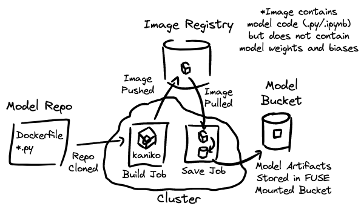
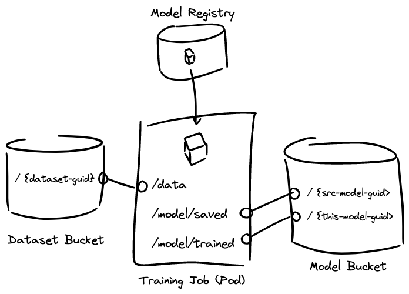

# Design

## Common Functionality across all Kinds

### Container Images

All Substratus kinds correspond to actions that are taken by containers. These containers can be built
by Substratus (from git, or from an upload) or referenced from external registries.

```yaml
spec:
  image:
    # Only one of the following fields should be set by the user:

    # Optional git source.
    git:
      url: https://github.com/substratusai/hf-model-loader

    # Optional upload source.
    upload: {}

    # Optionally specify image name to externally published container image
    # This field will be set by the controller if a build-source (above) was used.
    name: substratusai/hf-model-loader
```

If a container is built, the resulting image will use the following naming scheme:

```sh
image_name = {registry}/{cluster}-{lower(kind)}-{namespace}-{name}
```

For example:

```yaml
kind: Model
metadata:
  name: falcon-7b
  namespace: default
spec:
  image:
    git:
      # ...
    name: us-central1-docker.pkg.dev/my-project/my-repo/cluster1-model-default-falcon-7b
```

### Resources

```yaml
spec:
  resources:
    gpu:
      count: 8
      type: nvidia-l4
    cpu: 6
    disk: 30 # Gigabytes
    memory: 48 # Gigabytes
```

### Command

Optionally you can override the default command of a container by providing
`command` in the Substratus resource:

```yaml
spec:
  command: ["train.sh"]
```

### User

Substratus seeks to match the colab environment.

All containers should use the `root` user for all training, importing, and notebook operations. This allows for users to easily install tools with `apt-get` similar to colab. The `/content` directory should correspond to the `WORKDIR` of all Dockerfiles.

NOTE: gvisor can be used to mitigate security risks (See [GKE Sandbox](https://cloud.google.com/kubernetes-engine/docs/concepts/sandbox-pods)).

### Storage

#### Buckets

In Kubernetes the combination of the following fields make up a unique reference to a given object (i.e. database key): `split(.apiVersion, "/")[0] + .kind + .metadata.namespace + .metadata.name`. By storing related artifacts using a similar scheme, restore operations are made trivial: the administrator will not need to worry about backing up the `.status.url` field (as opposed to a scheme where storage location is `.metadata.uid` based - which would be unique for a given in-time instance of an object). When deleting and recreating clusters, if the storage bucket persisted, objects (i.e. Models, Datasets) can simply be re-applied into the new cluster (i.e. [velero](https://velero.io/)/similar is not needed). This plays nicely with GitOps.

Process:

Calculate a hash.

Hashes are used to [prevent bucket hot-spots](https://cloud.google.com/blog/products/gcp/optimizing-your-cloud-storage-performance-google-cloud-performance-atlas).

As opposed to a random id, a hash is used to provide a deterministic pattern storing and finding artifacts. By including a cluster name, Substratus can optionally store artifacts across multiple clusters in a single bucket if a compelling use-case arises in the future.

```sh
hash_input = "clusters/{cluster}/namespaces/{namespace}/{resource_plural}/{name}"

hash = md5(hash_input)
```

For example, with the following Model, with a default Substratus installation (cluster = `substratus-1`):

```yaml
kind: Model
metadata:
  name: falcon-7b
  namespace: team-a
```

The hash input string would be: `clusters/substratus-1/namespaces/team-a/models/falcon-7b`.

The resulting MD5 hash would be: `f94a0d128bcbd9c1b824e9e5572baf86`.

The following scheme can be used for storing artifacts for Models, Datasets, and Notebooks:

```sh
# Models
gs://{bucket}/{hash}/model     # Model artifacts (*.pt, etc)

# Datasets
gs://{bucket}/{hash}/data      # Data artifacts (*.jsonl, etc)

# Notebooks
gs://{bucket}/{hash}/build/{md5-checksum}.tar # Uploaded build context
```

The example Model's backing storage would end up being:

```sh
gs://abc123-substratus-artifacts/f94a0d128bcbd9c1b824e9e5572baf86/model/
```

The Model would report this URL in its status:

```yaml
kind: Model
# ...
status:
  url: gs://abc123-substratus-artifacts/f94a0d128bcbd9c1b824e9e5572baf86
```

#### Reconcile Logic

Pseudo-reconciler logic for a Model:

```
if .status.url != "" {
  return
}

url := "{bucket}/{hash}"
if sci.bucketObjectExists(url + "/completed.json") {
  # Use the bucket as the source of truth if .status.url did not exist.
  # If "completed.json" exists, it means that a given long-running
  # training/loading Job completed successfully.
  updateStatus(url)
  return
}

# ... Looks like the model should be imported/trained/etc.

runJob()
```

#### Mount Points

All mount points will are made under a standardized `/content` directory which should correspond to the `WORKDIR` of a Dockerfile. This works well for Jupyter notebooks which can be run with `/content` set as the serving directory: all relevant mounts will be populated on the file explorer sidebar.

##### Dataset (importing)

```
/content/params.json  # Populated from .spec.params (also available as env vars).

/content/output/        # Mounted RW: initially empty dir to write new files
```

##### Model (importing)

```
/content/params.json  # Populated from .spec.params (also available as env vars).

/content/output/       # Mounted RW: initially empty dir to write new files
```

##### Model (training)

```
/content/params.json        # Populated from .spec.params (also available as env vars).

/content/data/              # Mounted RO: from .spec.dataset

/content/model/             # Mounted RO: from .spec.model

/content/output/            # Mounted RW: initially empty dir for writing new files
```

##### Notebook

NOTE: The `saved-model/` directory is the same as the container for the Model object when `.baseModel` is specified. This allows for easy development of Model training code.

```
/content/params.json        # Populated from .spec.params (also available as env vars).

/content/data/              # Mounted RO: from .spec.dataset

/content/model/             # Mounted RO: from .spec.model

/content/output/            # Mounted RW: initially empty dir for writing new files
```

##### Server:

```
/content/params.json        # Populated from .spec.params (also available as env vars).

/content/model/             # Mounted RO: from .spec.model
```

### Naming

Jobs, Deployments, and Pods have a 63 character .metadata.name limit.
Datasets, Models, Servers, and Notebooks create these resources.
It is nice to name child resources something that easily identifies them
as belonging to a parent resource (i.e. similar name).
In order to do this, we need to limit the length of the parent resource name.
Suffixes should be short:

```
{parent.name}-{suffix}
```

Where suffix is a max of 13 characters.

This sets a max character limit of 50 for all Substratus types.

Examples:

```
Model:                    facebook-opt-125m
- Container build Job:    facebook-opt-125m-model-bld
- Training/importing Job: facebook-opt-125m-model
```

```
Dataset:                  squad
- Container build Job:    squad-dataset-bld
- Training/importing Job: squad-dataset
```

```
Notebook:                 my-fancy-experiment
- Container build Job:    my-fancy-experiment-notebook-bld # 13
- Notebook Pod:           my-fancy-experiment-notebook
```

```
Server:                   facebook-opt-125m-b
- Container build Job:    facebook-opt-125m-b-server-bld
- Deployment:             facebook-opt-125m-b-server
- Service:                facebook-opt-125m-b-server
```

## Kind: Model

A Model object represents a logical ML model.

The user specifies all the information needed to either A. Import a model, or B. Train/Finetune
a base model in the `.spec` block.

The controller reports the stored location of the model (bucket URL) in the `.status` block.

### Spec

#### .spec.params

```yaml
spec:
  params:
    abc: xyz # Environment variable will look like: PARAM_ABC=xyz
```

Parameters get converted to environment variables using the following scheme:

`PARAM_{upper(param_key)}={param_value}`

### Status

#### .status.url

This URL is used by the controller when other resources reference this Model by name. The controller can mount Model artifacts into other Model containers for training, into Notebooks for development purposes, or into a Server for loading and serving the Model over HTTP.

```yaml
status:
  url: gs://bucket/f94a0d128bcbd9c1b824e9e5572baf86
```

### Use cases

#### Use case: Importing Huggingface Models

A Model object could specify a Huggingface importer container which would download model weights and biases. The reference to the
Huggingface model is passed in via `.spec.params`.

```yaml
kind: Model
name: falcon-7b
spec:
  image:
    git:
      url: https://github.com/substratusai/model-loader-huggingface
      branch: main
  params: {name: tiiuae/falcon-7b}
  # ...
status:
  url: gcs://my-bucket/my-model/
  files: ["pytorch-001.bin", "config.json"]
  diskSize: 27Gi
```

The controller will orchestrate the following flow in this case:

</img>

#### Use case: Finetuning a Base Model

Models can be trained by specifying the `.spec.baseModel` section.

```yaml
apiVersion: substratus.ai/v1
kind: Model
metadata:
  name: falcon-7b-k8s
spec:
  image:
    git:
      url: https://github.com/substratusai/model-trainer-huggingface
  baseModel:
    name: falcon-7b
    #namespace: base-models
  trainingDataset:
    name: k8s-instructions
  params:
    epochs: 1
  resources:
    cpu: 2
    memory: 8
    gpu:
      count: 4
      type: nvidia-l4
```

This will orchestrate a training Job with the base model artifacts FUSE mounted.

</img>

## Kind: Notebook

Notebooks are used for development and experimentation purposes.

### Use cases

#### Use case: Experimenting with a model using Juptyer Notebooks

Example notebook worflow for a user starting with no specific model or dataset in mind. The spec here could use a stock substratus container image.

In this case, the `notebook-gpu` image would have all the `transformers`, `pytorch`, `cuda`, `python 3`, etc. libraries pre-installed.

```yaml
kind: Notebook
metadata:
  name: notebooks-for-anything
spec:
  image:
    name: substratusai/notebook-gpu
  resources:
    gpu:
      count: 4
      type: nvidia-l4
```

#### Use case: Iterate on Model Training Code

In this case, a user might want to update the code used for training in a Model object. The goal here is to create a development environment for the user that exactly mimics the training environment.

Steps:

1. `git clone https://substratusai/hf-llm-trainer && cd hf-llm-trainer`
2. [Optionally] Modify Dockerfile.
3. `kubectl open notebook -f .`
4. The kubectl plugin does the following:
   * Tars local directory respecting `.dockerignore`.
   * Creates an MD5 checksum of the tar.
   * Creates a Notebook with `.image.upload.checksum` set.
5. A Substratus controller in the background:
   * Creates a signed URL for the upload.
   * Updates the Notebook status with the signed URL.
6. The kubectl plugin continues:
   * Uploads tar to signed URL.
7. The Substratus controller is now orchestrating the build of this image using kaniko.
8. After the Notebook is marked as Ready (`.status.ready: true`), the kubectl plugin:
   * Copies local `*.py` files into the running notebook Pod.
   * Fetches a token reported in the Notebook `.status.token` field.
   * Opens browser to `http://localhost:8888?with-token=...`.

```yaml
kind: Notebook
name: notebook-training-experiment
spec:
  image:
    upload:
      checksum: 11ddbaf3386aea1f2974eee984542152 # This is how the plugin signals it wants to upload a directory for building.
  model: # Mounts the model. Plugin auto-populated this by finding the corresponding `model.yaml` file.
    name: falcon-7b
  resources: {...}
status:
  uploadURL: https://some-signed-url... # Controller populated this.
  # FUTURE:
  # token: aklsdjfkasdljfs # Jupyter notebook token reported by the controller.
```

#### Future use case: Notebook to Model Trainer

1. As `kubectl open notebook ...` is terminated by the user, files will be synced from the Notebook back to the local directory. We can hope but not guarantee this is a git repo.
2. Optional: During `kubectl open notebook ...` termination, a signal will be sent to the controller to build a container image which can serve as the trainer.
3. Potentially the user is prompted for this auto-generation: A `model-${epoch}.yaml` manifest having the values of that trainer will be generated into the repo root having either spec.container.image populated with the build from step 2 OR the repo/branch info taken from the local dir.

```yaml
kind: Model
name: falcon-7b-k8s-${epoch_or_branch_name}
spec:
  image:
    name: my-org/model-falcon-7b-k8s-trainer-${epoch_or_branch_name} # the just-built trainer image
  baseModel:
    name: falcon-7b
    #namespace: other-namespace
  trainingDataset: # determine this based on the running notebook - was a single dataset attached to it? In any other case, leave blank `{}` with a comment requiring more
    name: k8s-instructions
    #namespace: other-namespace
  resources: {}
  params:
    epochs: 1
```

## Kind: Server

Servers run Models to serve inference endpoints.

```yaml
kind: Server
spec:
  image:
    image: substratusai/basaran
  # model artifacts get mounted to /content/saved-model
  model:
    name: falcon-7b-k8s
  # FUTURE:
  resources: {}
```

### Possible Future Features

* Support embeddings?
* Support quantization?

```yaml
spec:
  quantization:
    bits: 4 # default is 16
```
