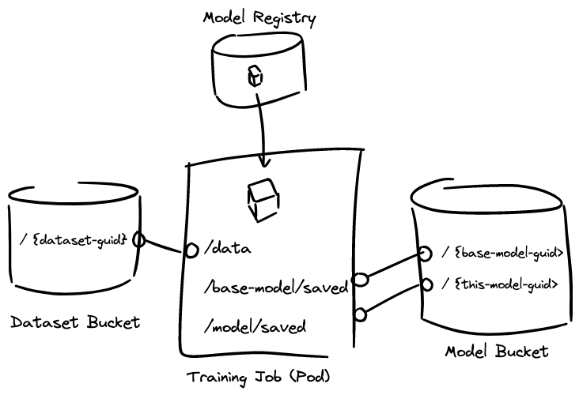

# Design

## Common Functionality across all Kinds

### Container Images

All Substratus kinds correspond to actions that are taken by containers. These containers can be built
by Substratus (from git, or from an upload) or referenced from external registries.

```yaml
spec:
  image:
    # Optional git source.
    git:
      url: https://github.com/substratusai/hf-model-loader
    
    # Optional upload source.
    upload: {}

    # Optionally specify image name.
    # This field will be set by the controller if a build-source (above) was used.
    name: substratusai/hf-model-loader
```

### Resources

```yaml
spec:
  resources:
    gpu:
      count: 3
      type: nvidia-l4
    cpu: 6
    disk: 30 # Gigabytes
    memory: 48 # Gigabytes
```

### Command

```yaml
spec:
  command: ["train.sh"]
```

## Kind: Model

A Model object represents a logical ML model.

The user specifies all the information needed to either A. Import a model, or B. Train/Finetune
a base model in the `.spec` block.

The controller reports the stored location of the model (bucket URL) in the `.status` block.

### Spec

#### .spec.params

```yaml
spec:
  params:
    abc: xyz # Environment variable will look like: PARAM_ABC=xyz
```

Parameters get converted to environment variables using the following scheme:

`PARAM_{upper(param_key)}={param_value}`

### Status

#### .status.url

This URL is used by the controller when other resources reference this Model by name. The controller can mount Model artifacts into other Model containers for training, into Notebooks for development purposes, or into a Server for loading and serving the Model over HTTP.

```yaml
status:
  url: gs://some-substratus-bucket/some-path/to/where-the/model-is-stored/
```

### Usecases

#### Usecase: Importing Huggingface Models

A Model object could specify a Huggingface importer container which would download model weights and biases. The reference to the
Huggingface model is passed in via `.spec.params`.

```yaml
kind: Model
name: falcon-7b
spec:
  image:
    git:
      url: https://github.com/substratusai/model-loader-huggingface
      branch: main
  params: {name: tiiuae/falcon-7b}
  # ...
status:
  url: gcs://my-bucket/my-model/
  files: ["pytorch-001.bin", "config.json"]
  diskSize: 27Gi
```

The controller will orchestrate the following flow in this case:

</img>

#### Usecase: Finetuning a Base Model

Models can be trained by specifying the `.spec.baseModel` section. 

```yaml
kind: Model
name: falcon-7b-k8s
spec:
  image:
    git: 
      url: https://github.com/substratusai/model-trainer-huggingface
      branch: main
  baseModel:
    name: falcon-7b
    #namespace: other-namespace
  trainingDataset:
    name: k8s-instructions
    #namespace: other-namespace
  params: {epochs: 1}
  # ...
```

This will orchestrate a training Job with the base model artifacts FUSE mounted.

</img>

## Kind: Notebook

Notebooks are used for development and experimentation purposes.

### Use cases

#### Use case: Experimenting with a model using Juptyer Notebooks

Example notebook worflow for a user starting with no specific model or dataset in mind. The spec here could use a stock substratus container image.

In this case, the `notebook-gpu` image would have all the `transformers`, `pytorch`, `cuda`, `python 3`, etc. libraries pre-installed.

```yaml
kind: Notebook
metadata:
  name: notebooks-for-anything
spec:
  image:
    name: substratusai/notebook-gpu
  resources:
    gpu:
      count: 4
      type: nvidia-l4
```

#### Usecase: Iterate on Model Training Code

In this case, a user might want to update the code used for training in a Model object. The goal here is to create a development environment for the user that exactly mimics the training environment.

Steps:

1. `git clone https://substratusai/hf-llm-trainer && cd hf-llm-trainer`
2. [Optionally] Modify Dockerfile.
3. `kubectl open notebook -f .`
4. The kubectl plugin does the following:
   * Creates a Notebook with `.image.upload` set.
   * Tars local directory respecting `.dockerignore`
5. A Substratus controller in the background:
   * Creates a signed URL for the upload.
   * Updates the Notebook status with the signed URL.
6. The kubectl plugin continues:
   * Uploads tar to signed URL.
7. The Substratus controller is now orchestrating the build of this image using kaniko.
8. After the Notebook is marked as Ready (`.status.ready: true`), the kubectl plugin:
   * Copies local `*.py` files into the running notebook Pod.
   * Fetches a token reported in the Notebook `.status.token` field.
   * Opens browser to `http://localhost:8888?with-token=...`.

```yaml
kind: Notebook
name: notebook-training-experiment
spec:
  image:
    upload: {} # This is how the plugin signals it wants to upload a directory for building.
  model: falcon-7b # Mounts the model. Plugin autopopulated this by finding the corresponding `model.yaml` file.
  resources: {...} # Plugin autopopulated this by finding the corresponding `model.yaml` file.
status:
  uploadUrl: https://some-signed-url... # Controller populated this.
  token: aklsdjfkasdljfs # Reported by the controller.
```

#### Future use case: Notebook to Model Trainer

1. As `kubectl open notebook ...` is terminated by the user, files will be synced from the Notebook back to the local directory. We can hope but not guarantee this is a git repo.
2. Optional: During `kubectl open notebook ...` termination, a signal will be sent to the controller to build a container image which can serve as the trainer.
3. Potentially the user is prompted for this auto-generation: A `model-${epoch}.yaml` manifest having the values of that trainer will be generated into the repo root having either spec.container.image populated with the build from step 2 OR the repo/branch info taken from the local dir. 

```yaml
kind: Model
name: falcon-7b-k8s-${epoch_or_branch_name}
spec:
  image:
    name: my-org/model-falcon-7b-k8s-trainer-${epoch_or_branch_name} # the just-built trainer image
  baseModel:
    name: falcon-7b
    #namespace: other-namespace
  trainingDataset: # determine this based on the running notebook - was a single dataset attached to it? In any other case, leave blank `{}` with a comment requiring more
    name: k8s-instructions
    #namespace: other-namespace
  resources: {}
  params:
    epochs: 1
```

## Kind: Server

Servers run Models to serve inference endpoints.

```yaml
kind: Server
spec:
  image:
    image: substratusai/basaran
  # model artifacts get mounted to /model/saved
  model:
    name: falcon-7b-k8s
  # FUTURE:
  resources: {}
```

### Possible Future Features

* Support embeddings?
* Support quantization?

```yaml
spec:
  quantization:
    bits: 4 # default is 16
```
