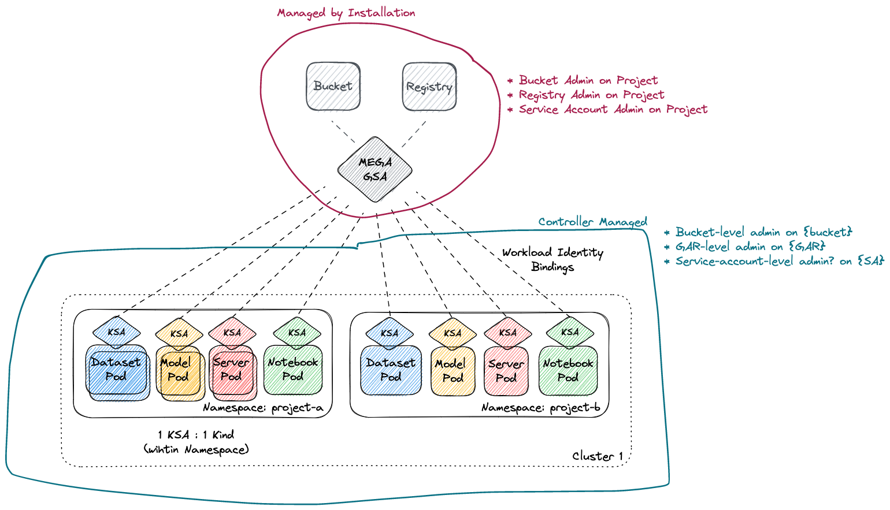

# Operator Managed Infra and multi namespace
Design doc: Not a feature yet

Instead of managing all the infrastructure through terraform, the
operator itself should be responsible for managing the Workload Identity
bindings between the K8s Service Account and the Cloud Service Account/IAM role.

Doing this, will make it possible to use Substratus resources in multiple
namespaces without having to use another tool to configure Cloud identity/role mappings.

Out of scope:
* Managing the bucket, image registry or other any other resources


## Why?
* Simplified install: Allow install to use `gcloud/aws` or `eksctl` to create initial K8s cluster + nodepools
* Make install onto existing K8s cluster straight forward and remove
  complexity of using Terraform
* Improved UX, all an end-user needs to do is install our manifests and ensure GCP service account has enough permissions
* Enterprises generally have very specific requirements about how they create their K8s Clusters and nodepools.
* Allow Substratus to work in a multi namespace environment. Currently namespace is hardcoded in workload identity settings in the terraform

## How?

</img>

### Installation
**Installation Flow** will be responsible for the following:
* Create a K8s cluster with nodes/GPUs, this step is optional if end-user already has a K8s cluster (eksctl or gcloud)
* Create Bucket, this step is optional if end-user already has a bucket
* Create Image Registry, this step is optional if end-user already has an image registry
* REQUIRED: Create Google Service Account or AWS IAM Role that has resource level permissions to:
  * read and write a specific bucket
  * pull and push to a specific Image Registry (GAR/ECR)
  * (GCP) set IAM policy on the service Account itself to be able to manage workload identity bindings to KSAs. This can be done by assigning the service account to be a ServiceAccountAdmin to itself
  * (AWS) UpdateAssumeRolePolicy on the AWS Role used by Substratus (required for multi namespace support)
* REQUIRED: Apply Substratus manifests and configure them to use correct bucket and image registry

### Controller
Controller will be responsible for the following:
* Creating the K8s ServiceAccount (already done today) and related binding by calling `enforceServiceAccount` whenever a Substratus resource gets reconciled
* (GCP only) example set annotation for Google Service Account (already done today) AND call CSI to update IAM policy on the Service Account so it can use the Google Service Account. For example:
  ```
  gcloud iam service-accounts add-iam-policy-binding substratus@my-project.iam.gserviceaccount.com \
   --role roles/iam.workloadIdentityUser \
   --member "serviceAccount:myproject.svc.id.goog[new-namespace/substratus]"
  ```
* (AWS Only) Annotate the service account with ARN of IAM role AND (awsmanager) use CSI to call UpdateAssumeRolePolicy
* Any API calls made to clouds should go through a cloud manager e.g. `gcpmanager` or `awsmanager`


## User Impact / Docs
New install docs:

1. (Optional) Create your GKE cluster and nodepools:
   ```
   gcloud container clusters create substratus 
   gcloud container node-pools create a100 \
     --machine-type a2-highpu-1g \
     --region us-central1 --cluster substratus \
     --node-locations us-central1-a,us-central1-c \
     --num-nodes 0 \
     --enable-autoscaling \
      --min-nodes 0 \
      --max-nodes 3
   ```

2. (Optional) Create a bucket that will be used for storing datasets and models:

   ```
   gcloud storage buckets create gs://$PROJECT_ID-substratus
   ```

3. (Optional) Create an Image Registry

   ```
   gcloud artifacts repositories create substratus \
     --repository-format=docker --location=us-central1 \
     --description="Docker repository"
   ```

4. Create a Google Service Account that has permissions to manage workload identity mappings and access bucket and registry

   ```
   gcloud iam service-accounts create substratus

   gcloud storage buckets add-iam-policy-binding \
     gs://$MYPROJECT-substratus --member=substratus-SA \
     --role=storage.admin
  
   gcloud artifacts repositories add-iam-policy-binding substratus \
     --location us-central1 \
     --member=substratus-SA \
     --role=registry admin

   gcloud iam service-accounts add-iam-policy-binding substratus@my-project.iam.gserviceaccount.com \
      --role roles/iam.serviceAccountAdmin \
      --member "serviceAccount:myproject.svc.id.goog[substratus/substratus]"
   ```

5. Install Substratus Operator(Create configmap and then apply all else)

   ```
   kubectl create ns substratus
   kubectl apply -f - <<EOF
   apiVersion: v1
   kind: ConfigMap
   metadata:
     name: system
     namespace: substratus
   data:
     bucket: gs://$PROJECT_ID-substratus
     registry: us-docker.pkg.dev/$PROJECT_ID-substratus
     serviceAccount: substratus@$PROJECT_ID.account.com
   EOF

   kubectl apply -f system.yaml
   ```