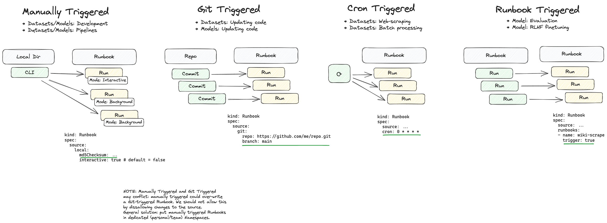
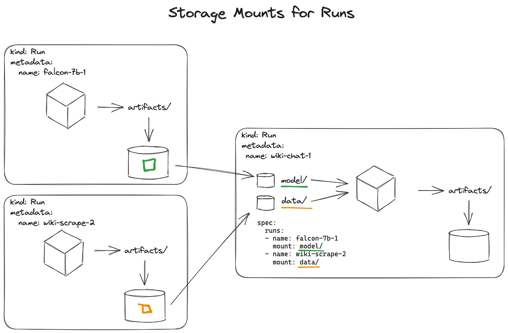

# Runbooks

Runbooks are the intersection of ideas from Colab Notebooks and Tecton Pipelines. Runbooks (i.e. Jupyter Notebooks) can be spun up quickly for development purposes, or launched as longrunning background processes. The execution of a Runbook (a Run) can store artifacts that other Runs can consume (i.e. datasets and base models mounted in a LLM finetuning job). Runbooks can be triggered from other Runbooks allowing for usecases such as ML model evaluation and scoring.

## Basics

Runbooks are templates for Runs.

A Runbook of the following:

```yaml
apiVersion: substratus.ai/v1
kind: Runbook
metadata:
  name: my-model
spec:
  index: 1 # Bump to create a new Run.
  params:
    epochs: 123
```

Will trigger a Run of the following:

```yaml
apiVersion: substratus.ai/v1
kind: Run
metadata:
  name: my-model-1
  labels:
    index: "1"
spec:
  params: # Copied from Runbook.
    epochs: 123
```

## Triggers

</img>

## Resources

Runbooks can express resource requirements, Runs express exact resources.

```yaml
kind: Runbook
metadata:
  name: wiki-chat
spec:
  resources:
    gpuMemoryGB:
      min: 30
    policy: Cheapest # alt: Fastest
```

```yaml
kind: Run
metadata:
  name: wiki-chat-1
spec:
  resources:
    nvidia-l4: 2
```

## Runbook Relationships

Runbooks can mount the artifacts of other Runbooks.

```yaml
kind: Runbook
metadata:
  name: wiki-chat
spec:
  runbooks:
  - name: wiki-web-scrape
    mount: data/
    trigger: true # Create a Run for every new Run in the referenced Runbook.
  - name: falcon-7b
    mount: base-model/
    index: 2 # Pin to an exact Run.
```

```yaml
kind: Run
metadata:
  name: wiki-chat-1
spec:
  runs:
  - name: wiki-web-scrape-3
    mount: data/
  - name: falcon-7b-2
    mount: base-model/
```

</img>
